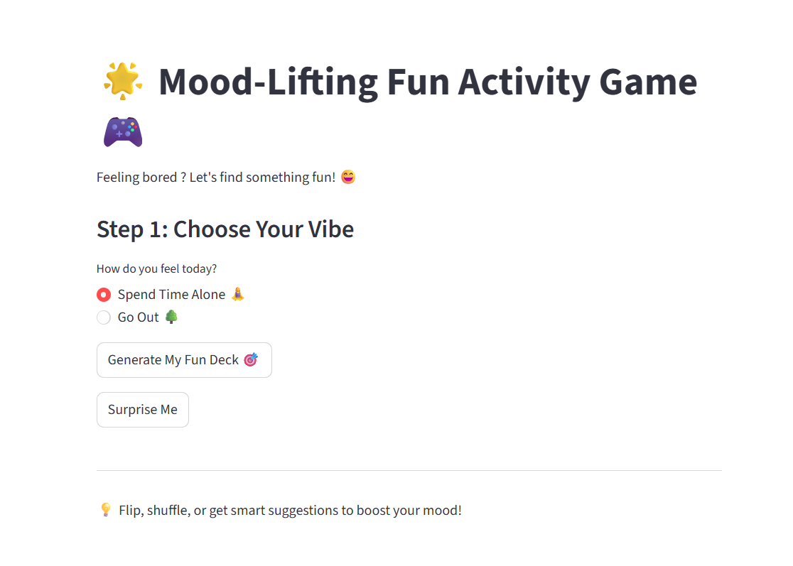

#  Daily Fun Activity Generator

A simple mood-based activity suggestion web app built using Python and Streamlit.

## 💡 About The Project

Sometimes we don’t know what to do when we’re bored.  
This app helps users quickly choose a fun activity based on their mood.

## ✨ Features

- 🎯 Choose between:
  - Spend Time Alone
  - Go Out
  - Surprise Me
- 🔀 Shuffle button for random suggestions
- 🎴 Card-style reveal experience
- 🧠 Smart filtering (home activities vs outdoor activities)

## 🛠 Built With

- Python
- Streamlit

## 🚀 How To Run

1. Install requirements:
pip install -r requirements.txt
2. Run the app:

streamlit run daily_fun_activity.py
## 📸 Preview

## 👩‍💻 Author

Bhagya Sewmini  
MIS Undergraduate | Exploring Tech & Creative Problem Solving